# Database Schema (Canonical)

> **Single source of truth.** This document is generated directly from the TypeORM entity definitions in `backend/src/modules/**/entities/*.entity.ts` as of **2026-07-14**. Do not hand-edit table shapes elsewhere — if the schema changes, update the entities first, then regenerate this doc.
>
> **Schema creation:** The database schema is created via TypeORM's `synchronize` option, not via migrations. `backend/src/config/database.config.ts`: `synchronize: process.env.DB_SYNCHRONIZE === 'true'`. This is wired into `TypeOrmModule.forRootAsync` in `app.module.ts`. When `DB_SYNCHRONIZE=true`, TypeORM auto-generates/updates tables from entity metadata on boot.
>
> **Migrations status:** `backend/src/database/migrations/` exists but is **completely empty**. It is referenced by a glob in `app.module.ts` (`migrations: [__dirname + '/database/migrations/**/*{.ts,.js}']`) but currently resolves to zero files — migrations are configured but unused in this codebase. (An orphaned `server/db/migrations/1704000000000-CreateIdentitySystem.ts` exists on disk but is **not** on the configured migrations path and is dead code.)

---

## 1. Two Data Layers

Nyuwe Zambia has two distinct persistence concepts that must not be confused:

### Backend: PostgreSQL (authoritative)
- Engine: PostgreSQL (`type: 'postgres'` in `TypeOrmModule.forRootAsync`, `app.module.ts`).
- All real data — users, inquiries, quotes, orders, payments, products, shops, schedules, categories, audit logs, portfolio items — lives here, defined by the TypeORM entities documented in Section 3.
- This is the **only** durable store. Everything else in the frontend is a live pass-through.

### Frontend: `AppDatabaseAPI` (Dexie-shaped shim — NOT actually Dexie)
- File: `src/services/api/database.ts`.
- **There is no Dexie.js in this codebase.** No `dexie` package dependency, no `new Dexie(...)`, no `.version(N).stores({...})` call anywhere in the repo. The only occurrence of the string "Dexie" in the entire `src` tree is a stale header comment ("Replaces IndexedDB (Dexie.js)").
- What actually exists is a hand-rolled class, `AppDatabaseAPI`, that mimics the shape of the Dexie Table/Query API (`add`, `put`, `get`, `update`, `delete`, `toArray`, `where().equals()/.anyOf()`, `bulkAdd`, `clear`) purely for interface familiarity during the migration.
- Every method body makes a live HTTP call via `apiClient` to a REST endpoint on the NestJS backend — **there is no local IndexedDB persistence, no offline cache, no client-side indexing**. The "Dexie" naming is legacy/vestigial.
- See Section 6 for the full endpoint mapping.

---

## 2. ERD Overview

```mermaid
erDiagram
    USERS ||--o{ USER_EMAILS : "has"
    USERS ||--o{ IDENTITY_AUDITS : "has"
    USERS ||--o| BUYER_PROFILES : "has"
    USERS ||--o| SELLER_PROFILES : "has"
    USERS ||--o| SERVICE_PROVIDER_PROFILES : "has"
    USERS ||--o{ INQUIRIES : "creates (buyerId)"
    USERS ||--o{ QUOTES : "submits (providerId)"
    USERS ||--o{ ORDERS : "buys (buyerId)"
    USERS ||--o{ ORDERS : "sells (sellerId)"
    USERS ||--o{ PAYMENTS : "owns"
    USERS ||--o{ PRODUCTS : "lists (sellerId)"
    USERS ||--o| SHOPS : "owns (sellerId)"
    USERS ||--o{ SCHEDULES : "owns"
    USERS ||--o{ PORTFOLIO_ITEMS : "owns"

    SELLER_PROFILES ||--o{ SELLER_PROFILE_ARCHETYPES : "serves"
    SELLER_PROFILES ||--o{ SELLER_PROFILE_CATEGORIES : "serves"
    SERVICE_PROVIDER_PROFILES ||--o{ SERVICE_PROVIDER_PROFILE_ARCHETYPES : "serves"
    SERVICE_PROVIDER_PROFILES ||--o{ SERVICE_PROVIDER_PROFILE_CATEGORIES : "serves"

    CATEGORIES ||--o{ CATEGORIES : "parentId (self-ref)"
    CATEGORIES ||--o{ SELLER_PROFILE_CATEGORIES : "categoryId"
    CATEGORIES ||--o{ SERVICE_PROVIDER_PROFILE_CATEGORIES : "categoryId"
    CATEGORIES ||--o{ INQUIRY_CATEGORIES : "categoryId"

    INQUIRIES ||--o{ INQUIRY_IMAGES : "has"
    INQUIRIES ||--o{ INQUIRY_CATEGORIES : "tagged with"
    INQUIRIES ||--o{ QUOTES : "receives"

    QUOTES ||--o{ ORDERS : "converts to (quoteId)"

    USER_EMAILS }o--|| USERS : "userId"
    IDENTITY_AUDITS }o--|| USERS : "userId"
    BUYER_PROFILES }o--|| USERS : "userId"
    SELLER_PROFILES }o--|| USERS : "userId"
    SERVICE_PROVIDER_PROFILES }o--|| USERS : "userId"
```

Notes on the diagram:
- `audit_logs` is not linked with hard FK relations in the entity (no `@ManyToOne` declared) — it stores loose `userId`/`providerId`/`staffId`/`entityId` uuid columns without relation metadata, so it is intentionally omitted from FK edges above.
- `shops` is enforced as `OneToOne` to `users`; the buyer/seller/service_provider profiles are logically one-per-user but declared as `ManyToOne` — see per-table notes for the exact decorator kind.

---

## 3. Per-Table Reference

### Module: Users & Identity

#### `users`
Auth identity only — NRC/UUID/displayId three-tier identity, active-profile pointer, team-member/department-head delegation.
Entity file: `backend/src/modules/users/entities/user.entity.ts`

| Column | Type | Null | Default | Notes |
|---|---|---|---|---|
| id | uuid | NO (PK) | — | `@PrimaryGeneratedColumn('uuid')` |
| nrcNumber | varchar(50) | YES | — | unique |
| displayId | varchar(20) | YES | — | unique |
| password | text | NO | — | `select:false`; `@Exclude({toPlainOnly:true})` |
| refreshToken | varchar(500) | YES | — | `select:false`; `@Exclude({toPlainOnly:true})` |
| role | enum | NO | `BUYER` | `BUYER, SELLER, SERVICE_PROVIDER, ADMIN` |
| name | varchar(255) | YES | — | ADMIN ONLY — every other role's name lives on its profile row; admins have no profile table, so this is the one carve-out. NULL on non-admin rows. |
| isNrcVerified | boolean | NO | `false` | |
| nrcDocumentPath | text | YES | — | `select:false`; `@Exclude({toPlainOnly:true})` |
| isActive | boolean | NO | `true` | |
| lastLoginAt | timestamp | YES | — | |
| lastNrcVerificationAt | timestamp | YES | — | |
| activeProfileId | uuid | YES | — | |
| activeProfileType | enum | YES | — | `BUYER, SELLER, SERVICE_PROVIDER` |
| parentProviderId | uuid | YES | — | Provider staff (parent = owner) OR admin "User Manager" sub-accounts (parent = primary admin) |
| permissions | simple-array | YES | — | Provider staff codes (`MANAGE_QUOTES`, …) or admin sub-account codes (`ADMIN_USERS`, `ADMIN_VERIFICATIONS`, `ADMIN_REPORTS`) |
| assignedArchetype | varchar(32) | YES | — | |
| mustChangePassword | boolean | NO | `false` | |
| isDepartmentHead | boolean | NO | `false` | |
| departmentAutonomy | enum | YES | — | `INDEPENDENT, MANAGED` |
| canMoveFinance | boolean | NO | `false` | |
| pin | varchar(4) | YES | — | `select:false`; `@Exclude({toPlainOnly:true})` |
| createdAt | timestamp | NO | — | `@CreateDateColumn()` |
| updatedAt | timestamp | NO | — | `@UpdateDateColumn()` |

Indexes: `idx_users_nrc` (nrcNumber, unique) · `idx_users_display_id` (displayId, unique) · `idx_users_role` (role) · `idx_users_created_at` (createdAt) · `idx_users_updated_at` (updatedAt) · `idx_users_parent_provider` (parentProviderId)

Relations: OneToMany → `user_emails` (`emails`, cascade:true, eager:false) · OneToMany → `identity_audits` (`identityAudits`, cascade:true, eager:false)

#### `user_emails`
Multi-email index for sign-in lookup per user; tracks primary/recovery/verification status.
Entity file: `backend/src/modules/users/entities/user-email.entity.ts`

| Column | Type | Null | Default | Notes |
|---|---|---|---|---|
| id | uuid | NO (PK) | — | `@PrimaryGeneratedColumn('uuid')` |
| userId | uuid | NO | — | |
| email | varchar(255) | NO | — | unique |
| isPrimary | boolean | NO | `false` | |
| verificationStatus | enum | NO | `NOT_VERIFIED` | `NOT_VERIFIED, VERIFICATION_SENT, VERIFIED` |
| verificationToken | varchar(255) | YES | — | `select:false` |
| verificationTokenExpiresAt | timestamp | YES | — | |
| verifiedAt | timestamp | YES | — | |
| isRecoveryEmail | boolean | NO | `false` | |
| createdAt | timestamp | NO | — | `@CreateDateColumn()` |
| updatedAt | timestamp | NO | — | `@UpdateDateColumn()` |

Indexes: `idx_user_emails_email` (email, unique) · `idx_user_emails_user_id` (userId) · `idx_user_emails_is_primary` (isPrimary) · `idx_user_emails_verification_status` (verificationStatus) · `idx_user_emails_created_at` (createdAt)

Relations: ManyToOne → `users` (userId → user.emails, `@JoinColumn({name:'userId'})`, `onDelete: CASCADE`, nullable:false)

#### `identity_audits`
Comprehensive audit trail for identity-related changes (fraud investigation, compliance, account recovery).
Entity file: `backend/src/modules/users/entities/identity-audit.entity.ts`

| Column | Type | Null | Default | Notes |
|---|---|---|---|---|
| id | uuid | NO (PK) | — | `@PrimaryGeneratedColumn('uuid')` |
| userId | uuid | NO | — | |
| eventType | enum | NO | — | `USER_REGISTERED, NRC_VERIFIED, NRC_VERIFICATION_FAILED, EMAIL_ADDED, EMAIL_REMOVED, EMAIL_PRIMARY_CHANGED, EMAIL_VERIFIED, PASSWORD_CHANGED, ACCOUNT_SUSPENDED, ACCOUNT_REACTIVATED, ACCOUNT_DELETED, SUSPICIOUS_ACTIVITY, ADMIN_ACTION` |
| description | text | NO | — | |
| previousValue | jsonb | YES | — | |
| newValue | jsonb | YES | — | |
| changedField | varchar(100) | YES | — | |
| adminId | uuid | YES | — | |
| ipAddress | varchar(50) | YES | — | |
| userAgent | text | YES | — | |
| isSuspicious | boolean | NO | `false` | |
| metadata | jsonb | YES | — | |
| verificationStatus | enum | NO | `UNVERIFIED` | `UNVERIFIED, VERIFIED, FRAUD` |
| statusNotes | text | YES | — | |
| createdAt | timestamp | NO | — | `@CreateDateColumn()` |

Indexes: `idx_identity_audits_user_id` (userId) · `idx_identity_audits_event_type` (eventType) · `idx_identity_audits_created_at` (createdAt) · `idx_identity_audits_user_event` (userId, eventType) · `idx_identity_audits_user_date` (userId, createdAt)

Relations: ManyToOne → `users` (userId → user.identityAudits, `@JoinColumn({name:'userId'})`, `onDelete: CASCADE`, nullable:false)

#### `buyer_profiles`
Buyer-role profile: identity, contact, delivery/preferred-area location, category interests, verification, PIN.
Entity file: `backend/src/modules/users/entities/buyer-profile.entity.ts`

| Column | Type | Null | Default | Notes |
|---|---|---|---|---|
| id | uuid | NO (PK) | — | `@PrimaryGeneratedColumn('uuid')` |
| userId | uuid | NO | — | |
| name | varchar(255) | YES | — | |
| email | varchar(255) | YES | — | |
| phone | varchar(20) | YES | — | |
| dateOfBirth | date | YES | — | |
| profilePicture | text | YES | — | |
| socialLinks | text | YES | — | |
| subRole | varchar(50) | YES | — | `INDIVIDUAL_BUYER / COMPANY_BUYER / COMPANY_PROCUREMENT_OFFICER / COMPANY_SECRETARY / COMPANY_RECEPTIONIST / COMPANY_MANAGER` |
| province | varchar(100) | YES | — | |
| city | varchar(100) | YES | — | |
| area | varchar(255) | YES | — | |
| latitude | numeric(10,7) | YES | — | |
| longitude | numeric(10,7) | YES | — | |
| radius | numeric(6,2) | YES | — | |
| categories | simple-array | NO | `''` | buyer interest categories |
| verificationStatus | enum | NO | `PENDING` | `PENDING, VERIFIED, REJECTED, SUSPENDED, INCOMPLETE` |
| verificationRejectionReason | text | YES | — | |
| verifiedAt | timestamp | YES | — | |
| rejectedAt | timestamp | YES | — | |
| pin | varchar(4) | YES | — | `select:false`; `@Exclude({toPlainOnly:true})` |
| createdAt | timestamp | NO | — | `@CreateDateColumn` |
| updatedAt | timestamp | NO | — | `@UpdateDateColumn` |

Indexes: `idx_buyer_profiles_user` (userId) · `idx_buyer_profiles_verification` (verificationStatus)

Relations: ManyToOne → `users` (userId, `@JoinColumn({name:'userId'})`, `onDelete: CASCADE`)

#### `seller_profiles`
Seller-role profile: identity, contact, business identity (PACRA/ZRA), business location, verification, PIN.
Entity file: `backend/src/modules/users/entities/seller-profile.entity.ts`

| Column | Type | Null | Default | Notes |
|---|---|---|---|---|
| id | uuid | NO (PK) | — | |
| userId | uuid | NO | — | |
| name | varchar(255) | YES | — | |
| email | varchar(255) | YES | — | |
| phone | varchar(20) | YES | — | |
| dateOfBirth | date | YES | — | |
| profilePicture | text | YES | — | owner's photo (shop profile page) |
| logo | text | YES | — | business/shop logo — directory-card brand mark, distinct from profilePicture |
| coverImage | text | YES | — | shop image on directory cards; GET /shops falls back to newest product image |
| socialLinks | text | YES | — | |
| subRole | varchar(50) | YES | — | `PRODUCT_SELLER` |
| companyName | varchar(255) | YES | — | |
| tpin | varchar(20) | YES | — | |
| incorporationCertUrl | text | YES | — | |
| businessLicenseId | uuid | YES | — | |
| verificationStatus | enum | NO | `PENDING` | `PENDING, VERIFIED, REJECTED, SUSPENDED, INCOMPLETE` |
| verificationRejectionReason | text | YES | — | |
| verifiedAt | timestamp | YES | — | |
| rejectedAt | timestamp | YES | — | |
| province | varchar(100) | YES | — | |
| city | varchar(100) | YES | — | |
| area | varchar(255) | YES | — | |
| latitude | numeric(10,7) | YES | — | |
| longitude | numeric(10,7) | YES | — | |
| radius | numeric(6,2) | YES | — | |
| pin | varchar(4) | YES | — | `select:false`; `@Exclude({toPlainOnly:true})` |
| createdAt | timestamp | NO | — | `@CreateDateColumn` |
| updatedAt | timestamp | NO | — | `@UpdateDateColumn` |

Indexes: `idx_seller_profiles_user` (userId) · `idx_seller_profiles_verification` (verificationStatus)

Relations: ManyToOne → `users` (userId, `@JoinColumn({name:'userId'})`, `onDelete: CASCADE`)

#### `seller_profile_archetypes`
Junction: each archetype a seller profile serves. Composite PK (sellerProfileId, archetype).
Entity file: `backend/src/modules/users/entities/seller-profile-archetype.entity.ts`

| Column | Type | Null | Default | Notes |
|---|---|---|---|---|
| sellerProfileId | uuid | NO (PK) | — | |
| archetype | enum | NO (PK) | — | `RETAIL, RENTAL, BOOKING, LABOUR, REPAIR, SERVICE, EVENTS, ENTERTAINMENT, WHOLESALE` |

Indexes: `idx_seller_profile_archetypes_archetype` (archetype)

Relations: ManyToOne → `seller_profiles` (sellerProfileId, `@JoinColumn({name:'sellerProfileId'})`, `onDelete: CASCADE`)

#### `seller_profile_categories`
Junction: category a seller profile serves. Composite PK (sellerProfileId, categoryId).
Entity file: `backend/src/modules/users/entities/seller-profile-category.entity.ts`

| Column | Type | Null | Default | Notes |
|---|---|---|---|---|
| sellerProfileId | uuid | NO (PK) | — | |
| categoryId | varchar(64) | NO (PK) | — | |

Indexes: `idx_seller_profile_categories_category` (categoryId)

Relations: ManyToOne → `seller_profiles` (sellerProfileId, `@JoinColumn({name:'sellerProfileId'})`, `onDelete: CASCADE`) · ManyToOne → `categories` (categoryId, `@JoinColumn({name:'categoryId'})`, `onDelete: CASCADE`)

#### `service_provider_profiles`
Service-provider-role profile: identity, contact, labour-specific fields, business identity, verification, service-area location, PIN.
Entity file: `backend/src/modules/users/entities/service-provider-profile.entity.ts`

| Column | Type | Null | Default | Notes |
|---|---|---|---|---|
| id | uuid | NO (PK) | — | |
| userId | uuid | NO | — | |
| name | varchar(255) | YES | — | |
| email | varchar(255) | YES | — | |
| phone | varchar(20) | YES | — | |
| dateOfBirth | date | YES | — | |
| profilePicture | text | YES | — | owner's photo (shop profile page) |
| logo | text | YES | — | business logo — directory-card brand mark, distinct from profilePicture |
| coverImage | text | YES | — | showcase image on directory cards; GET /shops falls back to newest product image |
| socialLinks | text | YES | — | |
| subRole | varchar(50) | YES | — | `INDIVIDUAL_PROVIDER / AGENCY_PROVIDER / SKILLED_LABOUR` |
| labourCategory | varchar(50) | YES | — | only populated when subRole = SKILLED_LABOUR |
| labourSubTypes | simple-array | NO | `''` | |
| companyName | varchar(255) | YES | — | |
| tpin | varchar(20) | YES | — | |
| incorporationCertUrl | text | YES | — | |
| businessLicenseId | uuid | YES | — | |
| verificationStatus | enum | NO | `PENDING` | `PENDING, VERIFIED, REJECTED, SUSPENDED, INCOMPLETE` |
| verificationRejectionReason | text | YES | — | |
| verifiedAt | timestamp | YES | — | |
| rejectedAt | timestamp | YES | — | |
| province | varchar(100) | YES | — | |
| city | varchar(100) | YES | — | |
| area | varchar(255) | YES | — | |
| latitude | numeric(10,7) | YES | — | |
| longitude | numeric(10,7) | YES | — | |
| radius | numeric(6,2) | YES | — | |
| pin | varchar(4) | YES | — | `select:false`; `@Exclude({toPlainOnly:true})` |
| createdAt | timestamp | NO | — | `@CreateDateColumn` |
| updatedAt | timestamp | NO | — | `@UpdateDateColumn` |

Indexes: `idx_service_provider_profiles_user` (userId) · `idx_service_provider_profiles_verification` (verificationStatus)

Relations: ManyToOne → `users` (userId, `@JoinColumn({name:'userId'})`, `onDelete: CASCADE`)

#### `service_provider_profile_archetypes`
Junction: each archetype a service-provider profile serves. Composite PK (serviceProviderProfileId, archetype).
Entity file: `backend/src/modules/users/entities/service-provider-profile-archetype.entity.ts`

| Column | Type | Null | Default | Notes |
|---|---|---|---|---|
| serviceProviderProfileId | uuid | NO (PK) | — | |
| archetype | enum | NO (PK) | — | `RETAIL, RENTAL, BOOKING, LABOUR, REPAIR, SERVICE, EVENTS, ENTERTAINMENT, WHOLESALE` |

Indexes: `idx_sp_profile_archetypes_archetype` (archetype)

Relations: ManyToOne → `service_provider_profiles` (serviceProviderProfileId, `@JoinColumn({name:'serviceProviderProfileId'})`, `onDelete: CASCADE`)

#### `service_provider_profile_categories`
Junction: category a service-provider profile serves. Composite PK (serviceProviderProfileId, categoryId).
Entity file: `backend/src/modules/users/entities/service-provider-profile-category.entity.ts`

| Column | Type | Null | Default | Notes |
|---|---|---|---|---|
| serviceProviderProfileId | uuid | NO (PK) | — | |
| categoryId | varchar(64) | NO (PK) | — | |

Indexes: `idx_sp_profile_categories_category` (categoryId)

Relations: ManyToOne → `service_provider_profiles` (serviceProviderProfileId, `@JoinColumn({name:'serviceProviderProfileId'})`, `onDelete: CASCADE`) · ManyToOne → `categories` (categoryId, `@JoinColumn({name:'categoryId'})`, `onDelete: CASCADE`)

---

### Module: Inquiries

#### `inquiries`
Entity file: `backend/src/modules/inquiries/entities/inquiry.entity.ts`

| Column | Type | Null | Default | Notes |
|---|---|---|---|---|
| id | uuid | NO (PK) | — | `@PrimaryGeneratedColumn('uuid')` |
| displayId | varchar(20) | YES | — | unique |
| title | varchar(255) | NO | — | |
| description | text | NO | — | |
| buyerId | uuid | NO | — | |
| location | varchar(255) | NO | — | human-readable City, Province snapshot |
| province | varchar(100) | YES | — | |
| city | varchar(100) | YES | — | |
| latitude | decimal(10,6) | YES | — | |
| longitude | decimal(10,6) | YES | — | |
| radius | integer | YES | — | |
| items | json | YES | — | |
| preferences | json | YES | — | |
| attributes | json | YES | — | |
| processType | enum | NO | `STANDARD` | `EXPRESS, STANDARD` |
| status | enum | NO | `OPEN` | `OPEN, QUOTED, CLOSED` |
| currentStage | enum | NO | `quotation` | `quotation, purchase_order, order_confirmation, delivery_order, completed` |
| viewCount | integer | NO | `0` | |
| maxQuotes | integer | NO | `3` | how many quotes buyer wants before slot full |
| responseDeadlineAt | timestamp | YES | — | hard deadline for provider response |
| archivedBy | simple-array | NO | `''` | |
| deletedBy | simple-array | NO | `''` | |
| isLabour | boolean | NO | `false` | |
| labourGroup | varchar(50) | YES | — | |
| labourSubType | varchar(50) | YES | — | |
| createdAt | timestamp | NO | — | `@CreateDateColumn` |
| updatedAt | timestamp | NO | — | `@UpdateDateColumn` |

Indexes: `idx_inquiries_buyer_id` (buyerId) · `idx_inquiries_status` (status) · `idx_inquiries_location` (location) · `idx_inquiries_created_at` (createdAt) · `idx_inquiries_buyer_status` (buyerId, status) · `idx_inquiries_display_id` (displayId, unique)

Relations: ManyToOne → `users` (buyerId, `@JoinColumn({name:'buyerId'})`, target entity User) · OneToMany → `inquiry_images` (`images`, eager:true, cascade:true, `onDelete: CASCADE`)

#### `inquiry_images`
Entity file: `backend/src/modules/inquiries/entities/inquiry-image.entity.ts`

| Column | Type | Null | Default | Notes |
|---|---|---|---|---|
| id | uuid | NO (PK) | — | `@PrimaryGeneratedColumn('uuid')` |
| inquiryId | uuid | NO | — | |
| imageUrl | varchar(500) | NO | — | URL for frontend display |
| imagePath | varchar(500) | NO | — | local server path |
| fileType | varchar(50) | YES | — | MIME type |
| fileSize | integer | YES | — | bytes |
| orderIndex | integer | NO | `0` | display order |
| uploadedAt | timestamp | NO | — | `@CreateDateColumn` |

Indexes: none

Relations: ManyToOne → `inquiries` (inquiryId, `@JoinColumn({name:'inquiryId'})`, `onDelete: CASCADE`, inverse side `Inquiry.images`)

#### `inquiry_categories`
Entity file: `backend/src/modules/inquiries/entities/inquiry-category.entity.ts`

| Column | Type | Null | Default | Notes |
|---|---|---|---|---|
| inquiryId | uuid | NO (PK) | — | `@PrimaryColumn`; part of composite PK |
| categoryId | varchar(64) | NO (PK) | — | `@PrimaryColumn`; part of composite PK |

Indexes: `idx_inquiry_categories_category` (categoryId)

Relations: ManyToOne → `inquiries` (inquiryId, `@JoinColumn({name:'inquiryId'})`, `onDelete: CASCADE`) · ManyToOne → `categories` (categoryId, `@JoinColumn({name:'categoryId'})`, `onDelete: CASCADE`, target entity Category)

---

### Module: Quotes

#### `quotes`
Entity file: `backend/src/modules/quotes/entities/quote.entity.ts`

| Column | Type | Null | Default | Notes |
|---|---|---|---|---|
| id | uuid | NO (PK) | — | `@PrimaryGeneratedColumn('uuid')` |
| inquiryId | uuid | NO | — | |
| inquiryTitle | varchar(255) | NO | — | denormalized |
| providerId | uuid | NO | — | |
| providerName | varchar(255) | NO | — | denormalized |
| price | decimal(12,2) | NO | — | |
| condition | varchar(50) | NO | — | |
| message | text | NO | — | |
| status | enum | NO | `PENDING` | `PENDING, ACCEPTED, REJECTED, ARCHIVED, PAID, PENDING_COLLECTION, AWAITING_PICKUP, COMPLETED, HANDED_OVER, SUPERSEDED` |
| expiryDuration | varchar(50) | YES | — | |
| isRead | boolean | NO | `false` | |
| isArchived | boolean | NO | `false` | |
| itemPrices | json | YES | — | `Record<string, any>[]` |
| buyerContact | json | YES | — | `Record<string, any>` |
| collectionCode | varchar(50) | YES | — | |
| requirements | json | YES | — | `Record<string, any>[]` |
| venueSpaceId | uuid | YES | — | |
| venueSpaceName | varchar(255) | YES | — | |
| damageDeposit | decimal(12,2) | YES | — | |
| cleaningFee | decimal(12,2) | YES | — | |
| dynamicFields | json | YES | — | `Record<string, any>` |
| processType | enum | NO | `STANDARD` | `EXPRESS, STANDARD` |
| delivery | json | YES | — | `Record<string, any>` |
| pickupLocation | varchar(255) | YES | — | |
| quoteType | enum | NO | `ORIGINAL` | `ORIGINAL, REVISION` |
| parentQuoteId | uuid | YES | — | |
| createdAt | timestamp | NO | — | `@CreateDateColumn` |
| updatedAt | timestamp | NO | — | `@UpdateDateColumn` |

Indexes: `idx_quotes_inquiry_id` (inquiryId) · `idx_quotes_provider_id` (providerId) · `idx_quotes_status` (status) · `idx_quotes_created_at` (createdAt) · `idx_quotes_inquiry_provider` (inquiryId, providerId)

Relations: ManyToOne → `inquiries` (inquiryId, `@JoinColumn({name:'inquiryId'})`, `onDelete: CASCADE`, target entity Inquiry) · ManyToOne → `users` (providerId, `@JoinColumn({name:'providerId'})`, target entity User, no `onDelete` specified)

---

### Module: Orders

#### `orders`
Entity file: `backend/src/modules/orders/entities/order.entity.ts`

| Column | Type | Null | Default | Notes |
|---|---|---|---|---|
| id | uuid | NO (PK) | — | `@PrimaryGeneratedColumn('uuid')` |
| quoteId | uuid | NO | — | |
| buyerId | uuid | NO | — | |
| sellerId | uuid | NO | — | |
| orderNumber | varchar(50) | NO | — | unique |
| totalAmount | decimal(12,2) | NO | — | |
| deliveryFee | decimal(12,2) | YES | — | |
| status | enum | NO | `PENDING` | `PENDING, CONFIRMED, SHIPPED, DELIVERED, COMPLETED, CANCELLED` |
| shippingAddress | varchar(255) | YES | — | |
| notes | text | YES | — | |
| items | json | YES | — | `Record<string, any>[]` |
| deliveryDate | timestamp | YES | — | |
| trackingNumber | varchar(100) | YES | — | |
| createdAt | timestamp | NO | — | `@CreateDateColumn` |
| updatedAt | timestamp | NO | — | `@UpdateDateColumn` |

Indexes: `idx_orders_buyer_id` (buyerId) · `idx_orders_seller_id` (sellerId) · `idx_orders_status` (status) · `idx_orders_created_at` (createdAt) · `idx_orders_buyer_seller` (buyerId, sellerId)

Relations: ManyToOne → `quotes` (quoteId, `@JoinColumn({name:'quoteId'})`, `onDelete: CASCADE`) · ManyToOne → `users` (buyerId, `@JoinColumn({name:'buyerId'})`) · ManyToOne → `users` (sellerId, `@JoinColumn({name:'sellerId'})`)

---

### Module: Payments

#### `payments`
Entity file: `backend/src/modules/payments/entities/payment.entity.ts`

| Column | Type | Null | Default | Notes |
|---|---|---|---|---|
| id | uuid | NO (PK) | — | `@PrimaryGeneratedColumn('uuid')` |
| transactionId | varchar(50) | NO | — | unique |
| userId | uuid | NO | — | |
| type | enum | NO | — | `DEPOSIT, PAYMENT, WITHDRAWAL, REFUND, TRANSFER` |
| amount | decimal(12,2) | NO | — | |
| fee | decimal(12,2) | NO | `0` | |
| netAmount | decimal(12,2) | NO | — | |
| status | enum | NO | `PENDING` | `PENDING, SUCCESS, FAILED, CANCELLED` |
| externalReference | varchar(255) | YES | — | |
| paymentMethod | varchar(50) | YES | — | |
| description | text | YES | — | |
| metadata | json | YES | — | |
| processedAt | timestamp | YES | — | |
| createdAt | timestamp | NO | — | `@CreateDateColumn()` |
| updatedAt | timestamp | NO | — | `@UpdateDateColumn()` |

Indexes: `idx_payments_user_id` (userId) · `idx_payments_status` (status) · `idx_payments_type` (type) · `idx_payments_created_at` (createdAt) · `idx_payments_reference` (externalReference, unique)

Relations: ManyToOne → `users` (userId, `@JoinColumn({name:'userId'})`)

> Note: `payments` keys off `userId` only — there is **no** `orderId` FK column on the entity (contrary to older docs).

---

### Module: Billing

#### `billing_settings`
Entity file: `backend/src/modules/billing/entities/billing-settings.entity.ts`

Single-row (get-or-create) platform monetization settings — same pattern as `promoter_settings` — admin-edited from the "Subscriptions" tab (`GET/PATCH /admin/billing-settings`, primary-admin-only). `subscriptionsEnabled` is the master switch for the whole monetization layer: OFF ⇒ buyers publish inquiries free AND shops owe no monthly fee (no paywall). `quoteTiers` seeds from the same 8 tiers `InquiryPreferences.tsx` used to hardcode; only `price` is admin-editable, `count` stays fixed. `quoteTiers` deliberately has **no db-level default** (json defaults are unreliable under `synchronize`) — `BillingService.getOrCreateSettings()` populates it when the row is first created.

| Column | Type | Null | Default | Notes |
|---|---|---|---|---|
| id | uuid | NO (PK) | — | `@PrimaryGeneratedColumn('uuid')` |
| subscriptionsEnabled | boolean | NO | `false` | master monetization ON/OFF |
| quoteTiers | json | YES | — | `[{count, price}]` ×8, buyer quotation-fee tiers |
| targetedInquiryFee | decimal(10,2) | NO | `10` | "This Shop Only" flat fee |
| monthlyFee | decimal(10,2) | NO | `100` | shop monthly subscription |
| createdAt | timestamp | NO | — | `@CreateDateColumn()` |
| updatedAt | timestamp | NO | — | `@UpdateDateColumn()` |

#### `shop_subscriptions`
Entity file: `backend/src/modules/billing/entities/shop-subscription.entity.ts`

One row per shop **owner** (`userId` = `parentProviderId ?? user.id` — staff resolve to, and may pay for, the owner's row). `paidUntil` null or in the past = not paying: `SubscriptionPaywall` blocks the SELLER/SERVICE_PROVIDER dashboard while `billing_settings.subscriptionsEnabled` is true. `POST /billing/subscription/pay` (simulated) extends `paidUntil` from `max(now, paidUntil)` by 30 days and writes a `payments` row (`type: PAYMENT`, `status: SUCCESS`, `metadata.kind: 'SHOP_SUBSCRIPTION'`) so renewals surface in the admin Financial tab.

| Column | Type | Null | Default | Notes |
|---|---|---|---|---|
| id | uuid | NO (PK) | — | `@PrimaryGeneratedColumn('uuid')` |
| userId | uuid | NO | — | owner user id, unique |
| paidUntil | timestamp | YES | — | |
| lastAmount | decimal(10,2) | YES | — | last renewal charge, display only |
| createdAt | timestamp | NO | — | `@CreateDateColumn()` |
| updatedAt | timestamp | NO | — | `@UpdateDateColumn()` |

Indexes: `idx_shop_subscriptions_user` (userId, unique)

Relations: ManyToOne → `users` (userId, `@JoinColumn({name:'userId'})`, `onDelete: CASCADE`)

---

### Module: Products

#### `products`
Entity file: `backend/src/modules/products/entities/product.entity.ts`

| Column | Type | Null | Default | Notes |
|---|---|---|---|---|
| id | uuid | NO (PK) | — | `@PrimaryGeneratedColumn('uuid')` |
| sellerId | uuid | NO | — | |
| name | varchar(255) | NO | — | |
| description | text | NO | — | |
| category | varchar(100) | NO | — | |
| subCategory | varchar(100) | YES | — | |
| price | decimal(12,2) | NO | — | |
| originalPrice | decimal(12,2) | YES | — | |
| stock | integer | NO | `0` | |
| images | simple-array | NO | `''` | typed as `string[]` |
| brand | varchar(100) | YES | — | |
| condition | varchar(50) | YES | — | |
| attributes | json | YES | — | typed as `Record<string, any>` |
| isActive | boolean | NO | `true` | |
| viewCount | integer | NO | `0` | |
| rating | decimal(3,2) | NO | `0` | |
| reviewCount | integer | NO | `0` | |
| createdAt | timestamp | NO | — | `@CreateDateColumn` |
| updatedAt | timestamp | NO | — | `@UpdateDateColumn` |

Indexes: `idx_products_seller_id` (sellerId) · `idx_products_category` (category) · `idx_products_name` (name) · `idx_products_created_at` (createdAt) · `idx_products_seller_category` (sellerId, category)

Relations: ManyToOne → `users` (sellerId, `@JoinColumn({name:'sellerId'})`, no `onDelete` specified)

> Note: there is **no** `shopId` FK column on `products` (contrary to older docs).

---

### Module: Shops

#### `shops`
Shop entity for sellers.
Entity file: `backend/src/modules/shops/entities/shop.entity.ts`

| Column | Type | Null | Default | Notes |
|---|---|---|---|---|
| id | uuid | NO (PK) | — | `@PrimaryGeneratedColumn('uuid')` |
| sellerId | uuid | NO | — | unique |
| name | varchar(255) | NO | — | |
| description | text | NO | — | |
| logo | varchar(255) | YES | — | |
| coverImage | varchar(255) | YES | — | |
| location | varchar(255) | NO | — | |
| latitude | decimal(10,6) | YES | — | |
| longitude | decimal(10,6) | YES | — | |
| socialLinks | json | YES | — | |
| contactInfo | json | YES | — | |
| isActive | boolean | NO | `true` | |
| rating | integer | NO | `0` | |
| reviewCount | integer | NO | `0` | |
| followerCount | integer | NO | `0` | |
| createdAt | timestamp | NO | — | `@CreateDateColumn` |
| updatedAt | timestamp | NO | — | `@UpdateDateColumn` |

Indexes: `idx_shops_seller_id` (sellerId, unique) · `idx_shops_name` (name)

Relations: OneToOne → `users` (sellerId, `@JoinColumn({name:'sellerId'})`)

---

### Module: Schedules

#### `schedules`
Entity file: `backend/src/modules/schedules/entities/schedule.entity.ts`

| Column | Type | Null | Default | Notes |
|---|---|---|---|---|
| id | uuid | NO (PK) | — | `@PrimaryGeneratedColumn('uuid')` |
| userId | uuid | NO | — | |
| title | varchar(255) | NO | — | |
| description | text | YES | — | |
| date | date | NO | — | |
| startTime | time | YES | — | |
| endTime | time | YES | — | |
| type | enum | NO | `OTHER` | `DELIVERY, MEETING, SERVICE, REMINDER, OTHER` |
| location | varchar(255) | YES | — | |
| status | enum | NO | `PENDING` | `PENDING, CONFIRMED, CANCELLED, COMPLETED` |
| metadata | json | YES | — | |
| createdAt | timestamp | NO | — | `@CreateDateColumn` |
| updatedAt | timestamp | NO | — | `@UpdateDateColumn` |

Indexes: `idx_schedules_user_id` (userId) · `idx_schedules_date` (date) · `idx_schedules_type` (type) · `idx_schedules_created_at` (createdAt)

Relations: ManyToOne → `users` (userId, `@JoinColumn({name:'userId'})`, target entity User)

> Note: there is **no** `inquiryId` FK column on `schedules` (contrary to older docs).

---

### Module: Calendar Events

#### `calendar_events`
Personal calendar entries — the generic scheduling module behind the dashboard right-rail calendar, the main-content schedule timeline and the `/schedule` page. One row per user-created event; always scoped to the owner (`userId` stamped from the JWT server-side, never client-supplied). Recurrence stores the rule only — occurrences are expanded client-side over the visible window.
Entity file: `backend/src/modules/calendar-events/entities/calendar-event.entity.ts`

| Column | Type | Null | Default | Notes |
|---|---|---|---|---|
| id | uuid | NO (PK) | — | `@PrimaryGeneratedColumn('uuid')` |
| userId | uuid | NO | — | Loose uuid, no FK relation (care_plans convention) |
| title | varchar(255) | NO | — | |
| description | text | YES | — | |
| date | date | NO | — | Base event day, `YYYY-MM-DD` |
| startTime | time | YES | — | `HH:MM`; null = all-day |
| endTime | time | YES | — | |
| location | varchar(255) | YES | — | |
| category | varchar(30) | NO | `OTHER` | `MEETING, REMINDER, APPOINTMENT, EVENT, PERSONAL, PARCEL_COLLECTION, MAKE_PAYMENT, OTHER` (varchar union, not a PG enum — evolvable without ALTER TYPE) |
| color | varchar(20) | YES | — | `blue, green, orange, purple, red, yellow`; null = derived from category |
| repeatRule | varchar(10) | NO | `NONE` | `NONE, DAILY, WEEKLY, MONTHLY, YEARLY` |
| reminderOffsetMinutes | int | YES | — | Minutes before startTime; null = no reminder (stored only — no server-side dispatch yet) |
| status | varchar(20) | NO | `CONFIRMED` | `CONFIRMED, COMPLETED, CANCELLED` |
| metadata | json | YES | — | Escape hatch |
| createdAt | timestamp | NO | — | `@CreateDateColumn` |
| updatedAt | timestamp | NO | — | `@UpdateDateColumn` |

Indexes: `idx_calendar_events_user` (userId) · `idx_calendar_events_date` (date)

Relations: none (loose uuid `userId`)

Migration: `1785700000000-CreateCalendarEvents.ts`

---

### Module: Categories

#### `categories`
Category catalog row; UI archetype driver, seeded from the `CATEGORIES_DB` TS catalog via `catalog.json`.
Entity file: `backend/src/modules/categories/entities/category.entity.ts`

| Column | Type | Null | Default | Notes |
|---|---|---|---|---|
| id | varchar(64) | NO (PK) | — | `@PrimaryColumn` |
| name | varchar(255) | NO | — | |
| parentId | varchar(64) | YES | — | FK column for self-referential parent relation |
| archetype | enum | NO | `RETAIL` | `RETAIL, RENTAL, BOOKING, LABOUR, REPAIR, SERVICE, EVENTS, ENTERTAINMENT, WHOLESALE` |
| nature | enum | NO | `PRODUCT` | `PRODUCT, SERVICE, BOTH` |
| actionVariant | enum | YES | — | `BUY_NEW, REPAIR`; null on parent rows and non-variant subs |
| createdAt | timestamp | NO | — | `@CreateDateColumn` |
| updatedAt | timestamp | NO | — | `@UpdateDateColumn` |

Indexes: `idx_categories_parent` (parentId) · `idx_categories_archetype` (archetype)

Relations: ManyToOne → `categories` (parentId, self-referential parent relation, nullable, `@JoinColumn({name:'parentId'})`, `onDelete: SET NULL`)

---

### Module: Audit

#### `audit_logs`
Entity file: `backend/src/modules/audit/entities/audit-log.entity.ts`

| Column | Type | Null | Default | Notes |
|---|---|---|---|---|
| id | uuid | NO (PK) | — | `@PrimaryGeneratedColumn('uuid')` |
| userId | uuid | YES | — | target user of the action |
| providerId | uuid | YES | — | |
| staffId | uuid | YES | — | actor id — provider staff, or the acting admin on moderation actions (`USER_VERIFIED/REJECTED/SUSPENDED/UNSUSPENDED`, `REPORT_RESOLVED/DISMISSED`) |
| staffName | varchar(100) | YES | — | actor label (admin displayId on moderation actions) |
| action | varchar(50) | NO | — | |
| entityType | varchar(100) | NO | — | |
| entityId | uuid | YES | — | |
| targetTitle | varchar(255) | YES | — | |
| buyerName | varchar(100) | YES | — | |
| amount | decimal(12,2) | YES | — | |
| details | text | YES | — | |
| changes | text | YES | — | JSON stringified per code comment |
| status | varchar(50) | YES | — | |
| reason | text | YES | — | |
| ipAddress | varchar(45) | YES | — | |
| userAgent | text | YES | — | |
| createdAt | timestamp | NO | — | `@CreateDateColumn()` |

Indexes: `idx_audit_logs_user_id` (userId) · `idx_audit_logs_action` (action) · `idx_audit_logs_entity` (entityType, entityId) · `idx_audit_logs_created_at` (createdAt)

Relations: none (no `@ManyToOne`/relation decorators declared — `userId`, `providerId`, `staffId`, `entityId` are loose uuid columns without FK relation metadata)

---

### Module: Reports (user complaints)

#### `user_reports`
User-submitted complaints against other users (buyer ↔ seller/provider). Filed via `POST /reports` (any authenticated user); reviewed under `/admin/reports*` by the primary admin or a User Manager holding `ADMIN_REPORTS`.
Entity file: `backend/src/modules/reports/entities/user-report.entity.ts`

| Column | Type | Null | Default | Notes |
|---|---|---|---|---|
| id | uuid | NO (PK) | — | `@PrimaryGeneratedColumn('uuid')` |
| reporterId | uuid | NO | — | filer's users.id |
| reportedUserId | uuid | NO | — | target's users.id |
| category | enum | NO | — | `SCAM_FRAUD, ABUSIVE_BEHAVIOR, NO_SHOW, FAKE_LISTING, PAYMENT_DISPUTE, OTHER` |
| description | text | NO | — | |
| contextType | enum | YES | — | `INQUIRY, QUOTE, ORDER` — surface the report was filed from |
| contextId | uuid | YES | — | |
| status | enum | NO | `OPEN` | `OPEN, RESOLVED, DISMISSED` |
| resolutionNote | text | YES | — | |
| resolvedByAdminId | uuid | YES | — | acting admin (primary or User Manager) |
| resolvedAt | timestamp | YES | — | |
| createdAt | timestamp | NO | — | `@CreateDateColumn()` |
| updatedAt | timestamp | NO | — | `@UpdateDateColumn()` |

Indexes: `idx_user_reports_reporter` (reporterId) · `idx_user_reports_reported` (reportedUserId) · `idx_user_reports_status` (status) · `idx_user_reports_created_at` (createdAt)

Relations: none — loose uuid columns like `audit_logs`, so reports survive either party's account deletion. One OPEN report per (reporter, target) pair is enforced in `ReportsService.create()` (409 on resubmit).

---

### Module: Reviews (shop ratings)

#### `shop_reviews`
A buyer's rating of a shop/provider, earned through a real trade: `POST /shops/:sellerUserId/reviews` only accepts a review when the caller has an order with that provider in DELIVERED or COMPLETED status. Aggregated (AVG + COUNT) into `GET /shops` and `GET /shops/:id/profile` via a pre-grouped `review_agg` CTE (pre-aggregation matters — the shops query fans out per category).
Entity file: `backend/src/modules/reviews/entities/shop-review.entity.ts`

| Column | Type | Null | Default | Notes |
|---|---|---|---|---|
| id | uuid | NO (PK) | — | `@PrimaryGeneratedColumn('uuid')` |
| providerUserId | uuid | NO | — | seller's users.id (= ShopResult.sellerId, NOT the profile row id) |
| reviewerUserId | uuid | NO | — | buyer's users.id |
| orderId | uuid | NO | — | the qualifying order |
| rating | int | NO | — | 1–5 |
| comment | text | YES | — | |
| createdAt | timestamp | NO | — | `@CreateDateColumn()` |
| updatedAt | timestamp | NO | — | `@UpdateDateColumn()` |

Indexes: `idx_shop_reviews_provider` (providerUserId) · `idx_shop_reviews_reviewer` (reviewerUserId) · `idx_shop_reviews_order` (orderId) · `idx_shop_reviews_reviewer_order_unique` (reviewerUserId, orderId — **unique**; one review per order, service catches 23505 → 409)

Relations: none — loose uuid columns like `audit_logs`/`user_reports`.

---

### Module: Portfolio

#### `portfolio_items`
Entity file: `backend/src/modules/portfolio/entities/portfolio-item.entity.ts`

| Column | Type | Null | Default | Notes |
|---|---|---|---|---|
| id | uuid | NO (PK) | — | `@PrimaryGeneratedColumn('uuid')` |
| userId | uuid | NO | — | |
| title | varchar(255) | NO | — | |
| youtubeUrl | text | NO | — | |
| eventName | varchar(255) | YES | — | |
| eventDate | date | YES | — | |
| description | text | YES | — | |
| createdAt | timestamp | NO | — | `@CreateDateColumn()` |
| updatedAt | timestamp | NO | — | `@UpdateDateColumn()` |

Indexes: `idx_portfolio_user_id` (userId)

Relations: ManyToOne → `users` (userId, `@JoinColumn({name:'userId'})`, `onDelete: CASCADE`, target entity User)

---

### Module: Referrals (promoter programme)

Hidden, invite-gated promoter accounts (`users.role = 'PROMOTER'`, minted only by `POST /promoter/signup` — the public register DTO rejects the role). PROMOTER users carry **no profile row**; their name/email/phone are denormalized onto `referral_links`.

#### `referral_links`
Entity file: `backend/src/modules/referrals/entities/referral-link.entity.ts`

| Column | Type | Null | Default | Notes |
|---|---|---|---|---|
| id | uuid | NO (PK) | — | `@PrimaryGeneratedColumn('uuid')` |
| promoterUserId | uuid | NO | — | 1:1 with the PROMOTER user |
| code | varchar(20) | NO | — | unique shareable code, `REF-XXXXXXXX` (`ReferralCodeUtil`, 32-char unambiguous charset) |
| promoterName | varchar(255) | NO | — | denormalized (no profile row exists) |
| promoterEmail | varchar(255) | NO | — | denormalized |
| promoterPhone | varchar(20) | YES | — | |
| isActive | boolean | NO | `true` | inactive codes stop capturing NEW conversions |
| createdAt / updatedAt | timestamp | NO | — | |

Indexes: `idx_referral_links_code` (code, unique) · `idx_referral_links_promoter` (promoterUserId, unique)

Relations: ManyToOne → `users` (promoterUserId, `onDelete: CASCADE`)

#### `conversions`
Entity file: `backend/src/modules/referrals/entities/conversion.entity.ts`

One row per referred user; `funnelStage` is monotonic (guarded UPDATE in `FunnelTrackingService.advanceStage`). The two `*AdvancedAt` timestamps are independent — a referred provider can jump `registration → trade_complete` with `inquiryAdvancedAt` staying NULL. Milestone counting reads the timestamps, not the coarse stage.

| Column | Type | Null | Default | Notes |
|---|---|---|---|---|
| id | uuid | NO (PK) | — | |
| referralLinkId | uuid | NO | — | FK → referral_links, CASCADE |
| promoterUserId | uuid | NO | — | denormalized from the link at insert |
| referredUserId | uuid | NO | — | **UNIQUE** — a user is referred exactly once |
| funnelStage | enum | NO | `'registration'` | `registration`, `inquiry`, `trade_complete` |
| inquiryAdvancedAt | timestamp | YES | — | set once, first own inquiry |
| tradeCompleteAdvancedAt | timestamp | YES | — | set once, first completed trade (order or quote path) |
| firstInquiryId | uuid | YES | — | audit |
| firstTradeSource | json | YES | — | audit, `{ type: 'order'\|'quote', id }` |
| createdAt / updatedAt | timestamp | NO | — | createdAt doubles as registeredAt |

Indexes: `idx_conversions_referred_user` (referredUserId, unique) · `idx_conversions_referral_link` (referralLinkId) · `idx_conversions_promoter_stage` (promoterUserId, funnelStage)

#### `milestones`
Entity file: `backend/src/modules/referrals/entities/milestone.entity.ts`

Admin-configured global goals (CRUD under `/admin/milestones`). Every mutation triggers a retro-award sweep + `MILESTONE_UPDATED` SSE broadcast.

| Column | Type | Null | Default | Notes |
|---|---|---|---|---|
| id | uuid | NO (PK) | — | |
| title | varchar(255) | NO | — | |
| targetStage | enum | NO | — | `inquiry`, `trade_complete` (never `registration`) |
| requiredCount | int | NO | — | DTO-validated ≥ 1 |
| equitySharesReward | decimal(12,2) | NO | — | |
| isActive | boolean | NO | `true` | |
| createdAt / updatedAt | timestamp | NO | — | |

Indexes: `idx_milestones_target_stage` (targetStage) · `idx_milestones_active` (isActive)

#### `promoter_profiles`
Entity file: `backend/src/modules/referrals/entities/promoter-profile.entity.ts`

1:1 identity profile captured AT SIGNUP (the invite key proves access, not identity): bio, the social platforms the artist runs, an ID document and a live selfie. Admin reviews via `GET /admin/promoters/:id` + `PATCH /admin/promoters/:id/verification`; identity re-uploads reset status to PENDING.

| Column | Type | Null | Default | Notes |
|---|---|---|---|---|
| id | uuid | NO (PK) | — | |
| userId | uuid | NO | — | unique, FK → users CASCADE |
| bio | text | YES | — | |
| socialLinks | json | YES | — | `[{ platform, url, handle? }]` — ≥1 required at signup |
| selfiePath | text | YES | — | base64 data URL (live selfie) |
| idDocumentPath | text | YES | — | base64 data URL (NRC/passport/licence) |
| verificationStatus | enum | NO | `'PENDING'` | `PENDING`, `VERIFIED`, `REJECTED` |
| rejectionReason | varchar(500) | YES | — | shown to the promoter on rejection |
| createdAt / updatedAt | timestamp | NO | — | |

Indexes: `idx_promoter_profiles_user` (userId, unique) · `idx_promoter_profiles_verification` (verificationStatus)

#### `promoter_settings`
Entity file: `backend/src/modules/referrals/entities/promoter-setting.entity.ts`

Single-row (get-or-create) programme settings. Holds the **admin-managed invite key** (rotated from the admin Milestones tab via `POST /admin/promoter-invite/rotate`, format `NYUWE-XXXXX-XXXXX`). Stored plaintext deliberately — it's a shared distribution secret the admin must read back, not a verify-only credential. When no row exists, `PROMOTER_INVITE_KEY` from the env is the fallback; neither ⇒ signup disabled.

| Column | Type | Null | Default | Notes |
|---|---|---|---|---|
| id | uuid | NO (PK) | — | |
| inviteKey | varchar(64) | NO | — | current gate for POST /promoter/signup |
| createdAt / updatedAt | timestamp | NO | — | updatedAt = last rotation |

#### `equity_awards`
Entity file: `backend/src/modules/referrals/entities/equity-award.entity.ts`

Simulated equity ledger — no payment/legal integration. `UNIQUE(promoterUserId, milestoneId)` IS the concurrency model: concurrent qualifiers both attempt the INSERT, the loser's `23505` is swallowed, exactly one award ever lands. `sharesAwarded` snapshots the reward at award time.

| Column | Type | Null | Default | Notes |
|---|---|---|---|---|
| id | uuid | NO (PK) | — | |
| promoterUserId | uuid | NO | — | FK → users, CASCADE |
| milestoneId | uuid | NO | — | FK → milestones, **RESTRICT** — paid-out milestones can't be deleted (admin DELETE 409s: deactivate instead) |
| sharesAwarded | decimal(12,2) | NO | — | snapshot |
| countAtAward | int | NO | — | audit |
| createdAt | timestamp | NO | — | doubles as awardedAt |

Constraints/Indexes: `uq_equity_awards_promoter_milestone` (promoterUserId, milestoneId, unique) · `idx_equity_awards_promoter` (promoterUserId)

---

### Module: Event Ticketing

Sellers in the events category create ticketed events and sell to guests through a public share link (`/e/:code`). Payment is simulated; the ledger credit is real — each PAID order posts a `TICKET_SALE` journal (Dr `PSP_HOLDING_ZMW` gross / Cr `SELLER_PAYABLE_ZMW` net / Cr `PLATFORM_COMMISSION_REVENUE_ZMW`). Migration: `1786103000000-CreateEventTicketing.ts`.

#### `ticket_events`
Entity file: `backend/src/modules/tickets/entities/ticket-event.entity.ts`

| Column | Type | Null | Default | Notes |
|---|---|---|---|---|
| id | uuid | NO (PK) | — | |
| sellerId | uuid | NO | — | users.id — no FK by convention |
| code | varchar(20) | NO | — | public share code `EVT-XXXXXX`, derived from id post-insert (EventCodeUtil) |
| title | varchar(255) | NO | — | |
| description | text | NO | — | |
| venue | varchar(500) | NO | — | free-text location |
| eventDate | timestamp | NO | — | when the event happens |
| posterUrl | varchar(500) | YES | — | `/files/upload?category=event-media` |
| status | enum | NO | `PUBLISHED` | `DRAFT`, `PUBLISHED`, `CANCELLED` — no approval gate; CANCELLED stops sales, reads as 404 publicly |
| createdAt / updatedAt | timestamp | NO | now() | |

Constraints/Indexes: `idx_ticket_events_code` (code, unique) · `idx_ticket_events_seller` (sellerId)

#### `ticket_tiers`
Entity file: `backend/src/modules/tickets/entities/ticket-tier.entity.ts`

`remainingQuantity` is the ONLY stock authority — decremented under a `FOR UPDATE` lock in the payment commit, never recomputed from sold tickets.

| Column | Type | Null | Default | Notes |
|---|---|---|---|---|
| id | uuid | NO (PK) | — | |
| eventId | uuid | NO | — | FK → ticket_events, CASCADE |
| name | varchar(120) | NO | — | e.g. Standard / VIP |
| priceZmw | numeric(10,2) | NO | — | |
| totalQuantity | int | NO | — | seller-entered capacity (display) |
| remainingQuantity | int | NO | — | stock authority |

Constraints/Indexes: `idx_ticket_tiers_event` (eventId)

#### `ticket_orders`
Entity file: `backend/src/modules/tickets/entities/ticket-order.entity.ts`

A guest's purchase. PENDING at checkout (no stock held); flipped to PAID inside the one atomic simulate-payment transaction. With no psp_transactions row behind the simulated payment, this row IS the audit trail — the journal memo points back at it.

| Column | Type | Null | Default | Notes |
|---|---|---|---|---|
| id | uuid | NO (PK) | — | |
| eventId | uuid | NO | — | ticket_events.id |
| reference | varchar(40) | NO | — | client polling handle `TKT-<ts>-<hex>` |
| buyerName | varchar(120) | NO | — | guest-entered |
| buyerPhone | varchar(40) | YES | — | service enforces phone OR email |
| buyerEmail | varchar(160) | YES | — | |
| lineItems | json | NO | — | `{tierId, tierName, quantity, unitPriceZmw}[]` — priced server-side |
| totalAmountZmw | numeric(10,2) | NO | — | |
| commissionZmw | numeric(10,2) | YES | — | stamped at payment from then-current settings |
| status | enum | NO | `PENDING` | `PENDING`, `PAID`, `FAILED` |
| createdAt / updatedAt | timestamp | NO | now() | |

Constraints/Indexes: `idx_ticket_orders_reference` (reference, unique) · `idx_ticket_orders_event` (eventId)

#### `tickets`
Entity file: `backend/src/modules/tickets/entities/ticket.entity.ts`

One row per admitted unit — each attendee gets their own code. `status` future-proofs door check-in/refunds; no endpoint mutates it yet.

| Column | Type | Null | Default | Notes |
|---|---|---|---|---|
| id | uuid | NO (PK) | — | |
| orderId | uuid | NO | — | ticket_orders.id |
| eventId | uuid | NO | — | denormalized for per-event lookups |
| tierId | uuid | NO | — | ticket_tiers.id |
| code | varchar(20) | NO | — | `TIX-XXXXXX` (TicketCodeUtil, seeded `orderId:seq`) |
| status | enum | NO | `VALID` | `VALID`, `REDEEMED`, `VOID` |
| createdAt | timestamp | NO | now() | |

Constraints/Indexes: `idx_tickets_code` (code, unique) · `idx_tickets_order` (orderId) · `idx_tickets_event` (eventId)

#### `event_ticket_settings`
Entity file: `backend/src/modules/tickets/entities/event-ticket-settings.entity.ts`

Get-or-create singleton (same pattern as `ad_settings`/`billing_settings`). Admin-edited via `PATCH /admin/tickets/settings`.

| Column | Type | Null | Default | Notes |
|---|---|---|---|---|
| id | uuid | NO (PK) | — | |
| commissionPercent | numeric(5,2) | NO | 5 | platform cut per ticket sale |
| createdAt / updatedAt | timestamp | NO | now() | |

---

## 4. Enums Reference

| Enum (owning table.column) | Values |
|---|---|
| `users.role` | `BUYER`, `SELLER`, `SERVICE_PROVIDER`, `ADMIN`, `PROMOTER` |
| `users.activeProfileType` | `BUYER`, `SELLER`, `SERVICE_PROVIDER` |
| `users.departmentAutonomy` | `INDEPENDENT`, `MANAGED` |
| `user_emails.verificationStatus` | `NOT_VERIFIED`, `VERIFICATION_SENT`, `VERIFIED` |
| `identity_audits.eventType` | `USER_REGISTERED`, `NRC_VERIFIED`, `NRC_VERIFICATION_FAILED`, `EMAIL_ADDED`, `EMAIL_REMOVED`, `EMAIL_PRIMARY_CHANGED`, `EMAIL_VERIFIED`, `PASSWORD_CHANGED`, `ACCOUNT_SUSPENDED`, `ACCOUNT_REACTIVATED`, `ACCOUNT_DELETED`, `SUSPICIOUS_ACTIVITY`, `ADMIN_ACTION` |
| `identity_audits.verificationStatus` | `UNVERIFIED`, `VERIFIED`, `FRAUD` |
| `buyer_profiles.verificationStatus` | `PENDING`, `VERIFIED`, `REJECTED`, `SUSPENDED`, `INCOMPLETE` |
| `seller_profiles.verificationStatus` | `PENDING`, `VERIFIED`, `REJECTED`, `SUSPENDED`, `INCOMPLETE` |
| `service_provider_profiles.verificationStatus` | `PENDING`, `VERIFIED`, `REJECTED`, `SUSPENDED`, `INCOMPLETE` |
| `seller_profile_archetypes.archetype` | `RETAIL`, `RENTAL`, `BOOKING`, `LABOUR`, `REPAIR`, `SERVICE`, `EVENTS`, `ENTERTAINMENT`, `WHOLESALE` |
| `service_provider_profile_archetypes.archetype` | `RETAIL`, `RENTAL`, `BOOKING`, `LABOUR`, `REPAIR`, `SERVICE`, `EVENTS`, `ENTERTAINMENT`, `WHOLESALE` |
| `inquiries.processType` | `EXPRESS`, `STANDARD` |
| `inquiries.status` | `OPEN`, `QUOTED`, `CLOSED` |
| `inquiries.currentStage` | `quotation`, `purchase_order`, `order_confirmation`, `delivery_order`, `completed` |
| `quotes.status` | `PENDING`, `ACCEPTED`, `REJECTED`, `ARCHIVED`, `PAID`, `PENDING_COLLECTION`, `AWAITING_PICKUP`, `COMPLETED`, `HANDED_OVER`, `SUPERSEDED` |
| `quotes.processType` | `EXPRESS`, `STANDARD` |
| `quotes.quoteType` | `ORIGINAL`, `REVISION` |
| `orders.status` | `PENDING`, `CONFIRMED`, `SHIPPED`, `DELIVERED`, `COMPLETED`, `CANCELLED` |
| `payments.type` | `DEPOSIT`, `PAYMENT`, `WITHDRAWAL`, `REFUND`, `TRANSFER` |
| `payments.status` | `PENDING`, `SUCCESS`, `FAILED`, `CANCELLED` |
| `schedules.type` | `DELIVERY`, `MEETING`, `SERVICE`, `REMINDER`, `OTHER` |
| `schedules.status` | `PENDING`, `CONFIRMED`, `CANCELLED`, `COMPLETED` |
| `categories.archetype` | `RETAIL`, `RENTAL`, `BOOKING`, `LABOUR`, `REPAIR`, `SERVICE`, `EVENTS`, `ENTERTAINMENT`, `WHOLESALE` |
| `categories.nature` | `PRODUCT`, `SERVICE`, `BOTH` |
| `categories.actionVariant` | `BUY_NEW`, `REPAIR` |
| `notifications.type` | `NEW_LEAD`, `QUOTE_RECEIVED`, `RESERVE_RELEASED`, `MILESTONE_UNLOCKED` |
| `conversions.funnelStage` | `registration`, `inquiry`, `trade_complete` |
| `milestones.targetStage` | `inquiry`, `trade_complete` |
| `promoter_profiles.verificationStatus` | `PENDING`, `VERIFIED`, `REJECTED` |
| `ticket_events.status` | `DRAFT`, `PUBLISHED`, `CANCELLED` |
| `ticket_orders.status` | `PENDING`, `PAID`, `FAILED` |
| `tickets.status` | `VALID`, `REDEEMED`, `VOID` |
| `ledger_journals.type` (addition) | `TICKET_SALE` added alongside `AD_PURCHASE` etc. |

---

## 5. Encryption & Security

- **Encrypted columns: none.** No database column is actually encrypted at rest in the current schema.
- `EncryptionService` (`backend/src/common/services/encryption.service.ts`) implements AES-256-CBC via Node's `crypto` module. Algorithm is sourced from config key `encryption.algorithm` (`aes-256-cbc`); key is derived with `crypto.scryptSync(keyString, 'salt', 32)`, IV with `crypto.scryptSync(ivString, 'salt', 16)`. It exposes generic `encrypt(data: string)` / `decrypt(data: string)` methods.
- However, a repo-wide search found **no other file importing or calling `EncryptionService`**, and no entity uses a TypeORM column transformer referencing it. The service is declared but not wired to any entity/column — the capability exists but is currently **unused (dead code)**.
- Sensitive fields are instead protected at the application layer via TypeORM `select:false` + `@Exclude({toPlainOnly:true})`, not column-level encryption:
  - `users.password`, `users.refreshToken`, `users.nrcDocumentPath`, `users.pin`
  - `buyer_profiles.pin`, `seller_profiles.pin`, `service_provider_profiles.pin`
  - `user_emails.verificationToken`
- Passwords are hashed with bcryptjs (10 salt rounds) at the service layer.

### Connection & environment variables
| Var | Default | Purpose |
|---|---|---|
| `DB_HOST` | `localhost` | Postgres host |
| `DB_PORT` | `5432` | Postgres port |
| `DB_USERNAME` | `tonse_user` | Postgres user |
| `DB_PASSWORD` | `password` | Postgres password |
| `DB_NAME` | `tonse_db` | Database name |
| `DB_SYNCHRONIZE` | `false` (unless `'true'`) | Auto-sync schema from entities on boot |
| `DB_LOGGING` | `false` (unless `'true'`) | TypeORM query logging |
| `NODE_ENV` | — | `production` enables `ssl: { rejectUnauthorized: false }` |
| `ENCRYPTION_KEY` | `your_32_character_key_here_1234` | Key for (currently unused) `EncryptionService` |
| `ENCRYPTION_IV` | `your_16_character_iv` | IV for (currently unused) `EncryptionService` |
| `PROMOTER_INVITE_KEY` | — (unset ⇒ signup hard-disabled) | Gates `POST /promoter/signup`; shared privately with NDA'd artists |
| `PROMOTER_APP_BASE_URL` | `http://localhost:5173` | Frontend origin used to build shareable referral URLs |

### Seed data
`backend/src/database/seeds/seed.ts` (run via `npm run seed`) creates exactly **one row** — a platform root ADMIN user. Credentials come from environment variables (`ADMIN_EMAIL`/`ADMIN_PASSWORD` required, `ADMIN_NAME`/`ADMIN_PHONE`/`ADMIN_NRC` optional) loaded from the gitignored `backend/.env`; the script exits with an error if email/password are unset or the password is under 8 characters, and it never logs the plaintext password. It is idempotent: it looks up an existing user by `ADMIN_EMAIL`; if found, it upgrades role to `ADMIN` and sets `isActive=true`, `verificationStatus='VERIFIED'` only where different — the password is only rotated (re-hashed from the current `ADMIN_PASSWORD`) when run as `npm run seed -- --reset-password`. If not found, it hashes `ADMIN_PASSWORD` with bcryptjs, registers with a placeholder NRC, then patches `verificationStatus` to `VERIFIED` and `isActive=true`. No other tables (categories, products, etc.) are seeded by this script.

---

## 6. Frontend Store Reference (`AppDatabaseAPI`, `src/services/api/database.ts`)

As established in Section 1, this is **not Dexie** — there are no client-side indexes or local persistence. Every "table" below is a thin REST wrapper; record shapes are TypeScript types imported from `../../types`, not schemas defined in this file.

| "Table" name | Backend endpoint | Notes / normalization |
|---|---|---|
| `users` | `/users` | Type: `User` |
| `inquiries` | `/inquiries` | Type: `Inquiry`; normalized via `transformInquiry` (parses `preferences`, `attributes`, `items`, `entertainmentData`, `repairData`; sanitizes `description`) |
| `quotes` | `/quotes` | Type: `Quote`; normalized via `transformQuote` (parses `itemPrices`; nested `inquiry` transformed via `transformInquiry`) |
| `transactions` | `/payments` | Type: `Transaction` |
| `shops` | `/shops` | Type: `Shop` |
| `products` | `/products` | Type: `Product` |
| `schedules` | `/schedules` | Type: `Schedule` |
| `calendarEvents` | `/calendar-events` | Type: `CalendarEvent` |
| `venueSpaces` | `/venue-spaces` | Type: `VenueSpace` |
| `auditLogs` | `/audit` | Type: `AuditLog`; normalized via `transformAuditLog` (maps `log.action` → `actionType`, derives `timestamp` from `createdAt`) |
| `purchaseOrders` | `/orders` | Type: `PurchaseOrder`; **shares the `/orders` endpoint** |
| `orderConfirmations` | `/orders` | Type: `OrderConfirmation`; **shares the `/orders` endpoint** |
| `deliveryOrders` | `/orders` | Type: `DeliveryOrder`; **shares the `/orders` endpoint** |

The class exposes a Dexie-shaped method surface (`add`, `put`, `get`, `update`, `delete`, `toArray`, `where().equals()`/`.anyOf()`, `bulkAdd`, `clear`) purely for interface familiarity during the ongoing migration off a legacy Dexie-based design — every method body resolves to an HTTP call via `apiClient`, with no IndexedDB fallback or local cache layer.

> Note: `calendarEvents` and `venueSpaces` are frontend store wrappers with no dedicated backend TypeORM entity in this schema (calendar events are derived; venue references are embedded on `quotes` as `venueSpaceId`/`venueSpaceName`).
